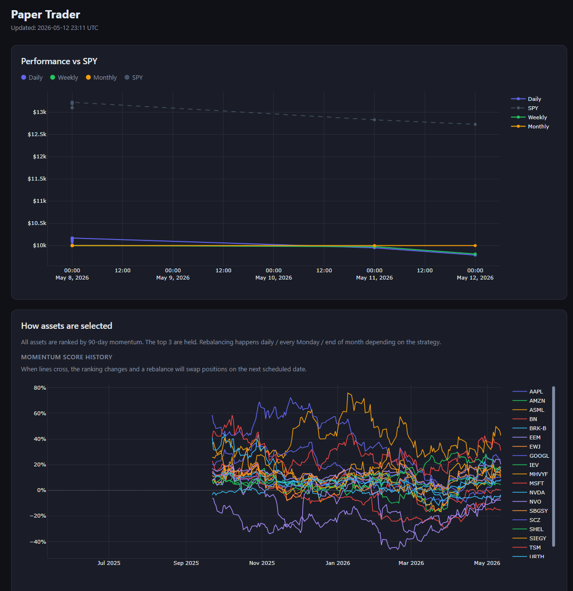
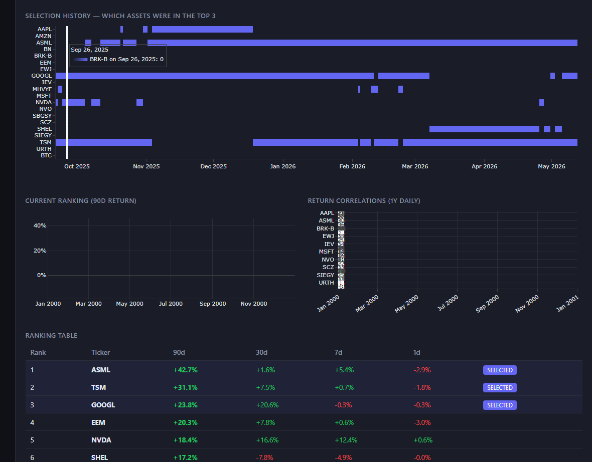

# paper-trader

A paper trading bot that runs automatically via GitHub Actions. Starts with $10,000 and tracks performance against SPY.

## What it does

Every 10 minutes during market hours (Mon–Fri, 9:30–17:00 ET), it:
1. Ranks a watchlist of stocks/ETFs by 90-day momentum
2. Rebalances into the top 3, equal-weighted
3. Sends email/SMS alerts if any holding drops >3%, goes oversold (RSI < 35), or breaks below its 50-day SMA
4. Logs trades and updates an equity curve dashboard

Three strategies run in parallel: **daily** (rebalances every run), **weekly** (Mondays), and **monthly** (on the 28th+).

## How it selects

Pure momentum. Each asset's 90-day return is calculated, everything is ranked, and the top 3 go into the portfolio at equal weight. No fundamentals, no forecasting — just "what's been going up lately."

**Watchlist:** US mega-caps (AAPL, MSFT, NVDA, GOOGL, AMZN), global ETFs (URTH, EEM, IEV, EWJ, SCZ), international stocks (TSM, ASML, NVO, SHEL, BRK-B, and others), plus BTC.

## Dashboard




## Setup

Add these as GitHub repository secrets:

```
GMAIL_CLIENT_ID, GMAIL_CLIENT_SECRET, GMAIL_REFRESH_TOKEN
EMAIL_FROM, EMAIL_TO
TWILIO_SID, TWILIO_TOKEN, TWILIO_FROM, TWILIO_TO  # optional, for SMS
```

Enable GitHub Pages from the `docs/` folder to view the dashboard.

dashboard is found here:

https://gustavwrisberg.github.io/paper-trader/

